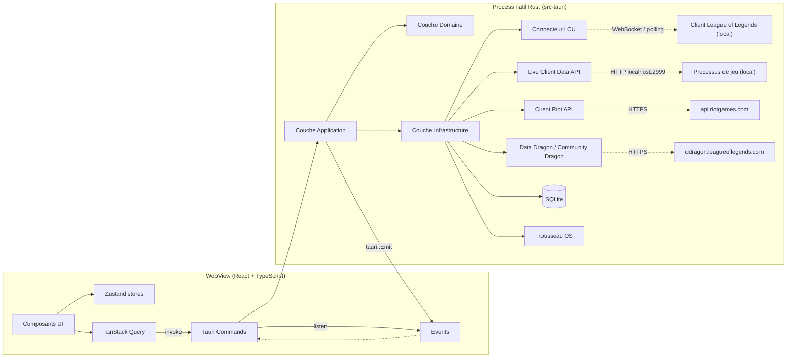
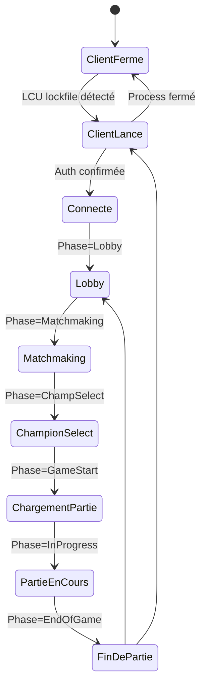
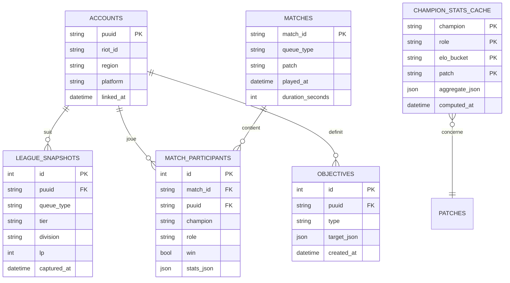

# Architecture

## Vue d'ensemble

Wardstone est une application desktop **Tauri v2** : un frontend web (React/TypeScript)
rendu dans une WebView native, et un backend natif (Rust) qui s'exécute comme process
séparé et expose des **commandes** (RPC synchrone/async) et des **événements** (push
asynchrone) au frontend via le pont IPC de Tauri.



## Principes directeurs

- **Clean Architecture** : les dépendances pointent vers l'intérieur. Le domaine ne connaît
  ni Riot API, ni SQLite, ni Tauri.
- **SOLID** : chaque service a une responsabilité unique ; les traits Rust (`RiotApiClient`,
  `MatchRepository`, `LcuConnector`...) définissent des ports, implémentés par
  l'infrastructure et injectés dans l'application.
- **DDD léger** : bounded contexts par domaine métier (Compte, Statistiques de match,
  Sélection de champion, Partie en direct, Coaching, Objectifs).
- **Feature-based** côté frontend : chaque fonctionnalité est un module autonome
  (composants, hooks, store local, types) sous `src/features/<feature>`.
- **Repository Pattern** pour toute persistance (SQLite) et tout accès API externe.
- **Dependency Injection** manuelle en Rust via un `AppState` construit au démarrage et
  partagé via `tauri::State`, contenant les implémentations concrètes derrière des `Arc<dyn Trait>`.

## Backend Rust (`src-tauri/src`)

```
src-tauri/src/
├── main.rs                 Point d'entrée, construction de l'AppState, enregistrement
│                            des commandes/plugins/fenêtres
├── lib.rs                  Ré-export public (pour les tests d'intégration)
├── commands/                Couche adaptateur : commandes Tauri, mapping DTO <-> domaine
│   ├── accounts.rs
│   ├── profile.rs
│   ├── champion_select.rs
│   ├── team_analysis.rs
│   ├── history.rs
│   ├── live_game.rs
│   ├── objectives.rs
│   ├── coaching.rs
│   ├── comparison.rs
│   ├── search.rs
│   ├── static_data.rs
│   └── settings.rs
├── domain/                  Entités, value objects, règles métier pures (aucune I/O)
│   ├── account.rs
│   ├── summoner.rs
│   ├── match_.rs
│   ├── champion_stats.rs
│   ├── team_analysis.rs
│   ├── objective.rs
│   └── ports.rs             Traits (ports) implémentés par l'infrastructure
├── application/              Cas d'usage (orchestration domaine + ports)
│   ├── link_account.rs
│   ├── sync_profile.rs
│   ├── build_champion_select_recommendation.rs
│   ├── analyze_team.rs
│   ├── ingest_match_history.rs
│   ├── generate_coaching_report.rs
│   └── track_objectives.rs
├── infrastructure/
│   ├── lcu/                 Découverte du lockfile, client REST auto-signé, WebSocket WAMP
│   ├── live_client/          Poller Live Client Data API (localhost:2999)
│   ├── riot_api/              Client HTTP Riot (routing régional, rate limiter, retry)
│   ├── data_dragon/           Client Data Dragon / Community Dragon + cache disque
│   ├── db/                   SQLite : migrations, repositories concrets
│   ├── cache/                 Cache TTL générique en mémoire (moka)
│   └── secure_storage/        Abstraction trousseau OS (crate `keyring`)
├── stats_engine/              Agrégation locale (builds/runes/skill order/counters/banrate)
├── coaching/                  Heuristiques de coaching post-partie
└── game_state/                Machine à états de la partie (phases gameflow)
```

### Machine à états de la partie



Chaque transition émet un événement Tauri (`game-phase-changed`) consommé par le frontend
pour adapter automatiquement l'interface (afficher l'assistant de sélection, ouvrir
l'overlay, etc.).

## Frontend (`src`)

```
src/
├── app/                 Bootstrap, routeur, providers (QueryClient, Theme, Toaster)
├── features/
│   ├── accounts/
│   ├── dashboard/
│   ├── profile/
│   ├── champion-select/
│   ├── team-analysis/
│   ├── history/
│   ├── objectives/
│   ├── coaching/
│   ├── comparison/
│   ├── search/
│   ├── settings/
│   └── notifications/
├── overlay/              Point d'entrée dédié à la fenêtre overlay (bundle séparé)
├── shared/
│   ├── components/       Design system (Button, Card, Badge, Modal, Sparkline...)
│   ├── hooks/
│   ├── lib/               Wrapper typé autour de `invoke`/`listen` (tauri-bridge.ts)
│   ├── stores/             Zustand (theme, game-phase, active-account)
│   └── types/               Types partagés générés/alignés avec les DTO Rust
└── styles/
```

## Persistance (SQLite)



## Sources de données et conformité

| Donnée | Source officielle | Notes |
|---|---|---|
| Rang, LP, historique, maîtrise | Riot API (`league-v4`, `match-v5`, `champion-mastery-v4`) | Clé API personnelle utilisateur |
| Détails de partie | `match-v5` | Bans inclus → sert de base au calcul de banrate |
| Champions, objets, runes, sorts | Data Dragon | Mis à jour à chaque patch |
| Splash arts, assets HD | Community Dragon | CDN public communautaire |
| Phase de jeu, session de sélection | LCU API (local, `127.0.0.1:<port>` via lockfile) | Aucune modification du client, lecture seule |
| Données in-game (or, items, events) | Live Client Data API (local, `127.0.0.1:2999`) | Fournie officiellement par Riot pendant une partie |
| Builds/runes/winrate/pickrate/banrate agrégés | **Calculés localement** par le `stats_engine` à partir des matchs collectés via `match-v5` | Pas de scraping de sites tiers — 100% conforme aux CGU Riot |
| MMR | **Estimation heuristique** (non fournie par Riot) | Toujours affiché avec la mention « estimé » |

## Performance

- Démarrage : fenêtre principale affichée avant l'initialisation complète du backend
  (splashscreen léger), connexions LCU/Live Client en tâches asynchrones non bloquantes.
- Cache mémoire (TTL) + cache disque (SQLite) pour limiter les appels Riot API et respecter
  les limites de rate-limit (100 req/2min en dev, configurable en prod).
- Polling LCU adaptatif : intervalle court en `ChampSelect`/`InProgress`, long sinon.
- Overlay : rendu séparé, budget CPU/mémoire dédié, désactivable entièrement.

## Sécurité

- Clé API Riot chiffrée via le trousseau OS (`keyring` crate → Windows Credential Manager).
- Aucune clé/API secret dans les logs (masquage systématique).
- Retry avec backoff exponentiel + circuit breaker sur les appels Riot API.
- Recovery : état de session persistant en SQLite, reprise après crash sans perte de compte lié.
